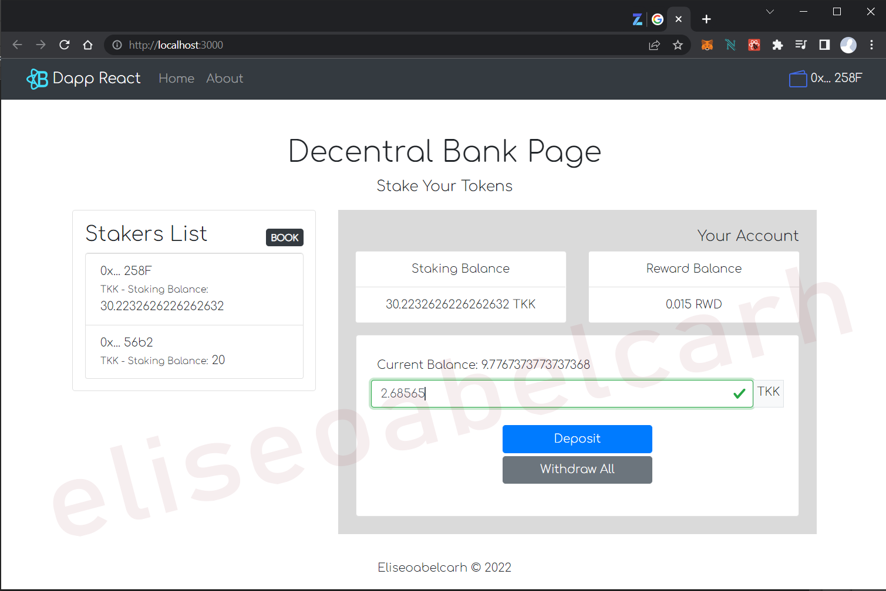
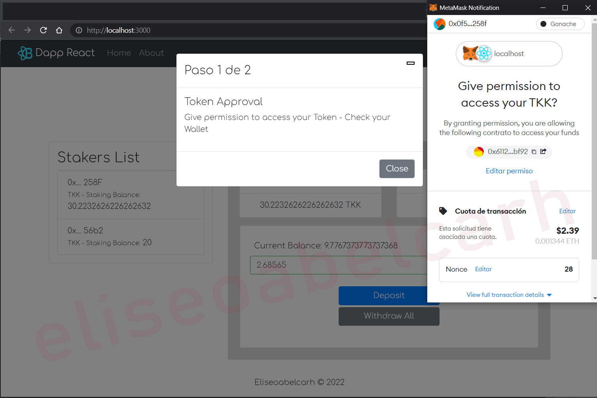
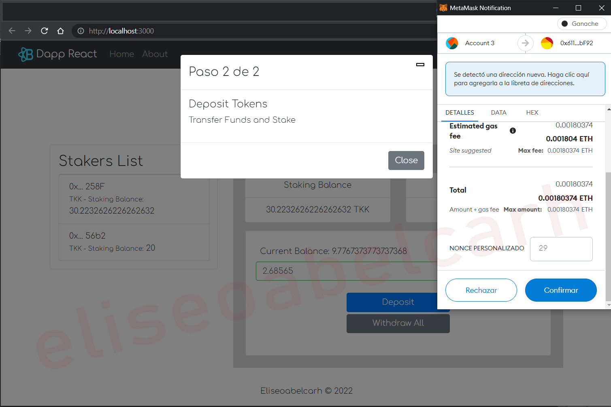
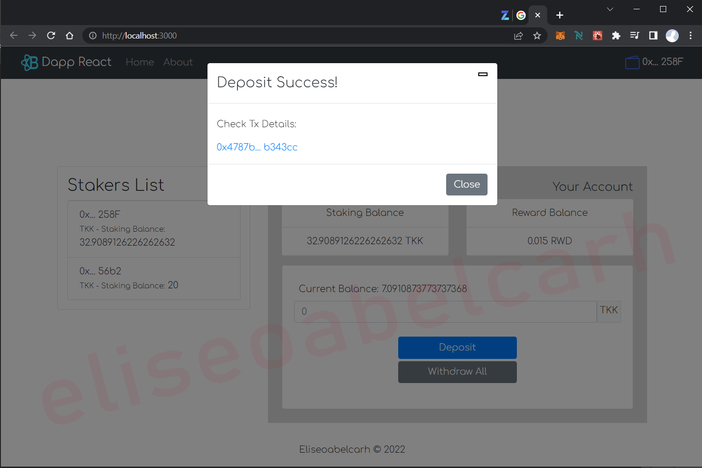
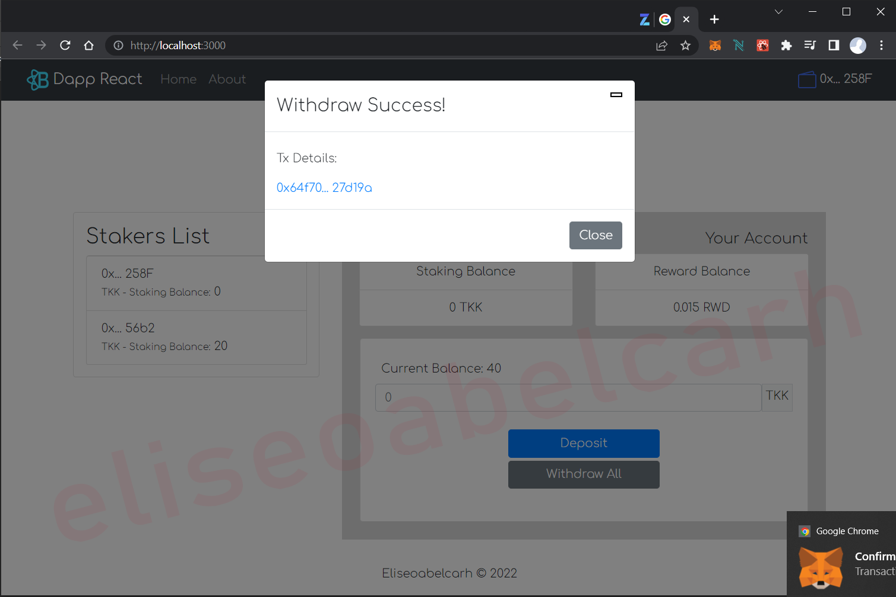

# Real Time Render Dapp - Bank Staking Token ERC20
## React Bootstrap Metamask OpenZeppelin Web3


 Dapp Staking Bank is a dapp created by [Eliseoabelcarh]. Ready to Fork or Clone and deploy. No issues or bugs encountered (yet).

##### Save time and go to the bottom of the page to see Screenshots.

## Download and Installation

This is a Dapp with real usage potential.
To begin using this template, choose one of the following options to get started:

Fork or clone the repository.

Install the dependencies:

```powershell-interactive
npm install
```
## Run Ganache First 

### Deploy contracts:
```powershell-interactive
truffle migrate --reset
```
(Modify 2_deploy_contracts.js if you want change deploy conditions - Initial deploy: 2 accounts with initial funds)

## Usage

Start editing and customizing according to your needs.

Run locally:

```powershell-interactive
npm start
```

## Functionalities:
- Loading Button to Connect Metamask
- Token ERC20 created with OpenZeppelin Interface.  
- Re-render UI if changes account Metamask
- Load Blockchain Data when Events are triggered
- React Routes for pages navigation
- React Redux for components states
- Form with Balance Account validation
- Show List of Stakers of Smart Contract
- Instructions and Notifications for Transactions
- Unit Tests for Contracts

## Dependencies:

- React
- react-bootstrap
- Web3
- OpenZeppelin
- Redux 
- Mocha y Chai
- Chainlink

## Bugs and Issues

Have a bug or an issue with this dapp? Open a new issue here on GitHub.

### Screenshots






