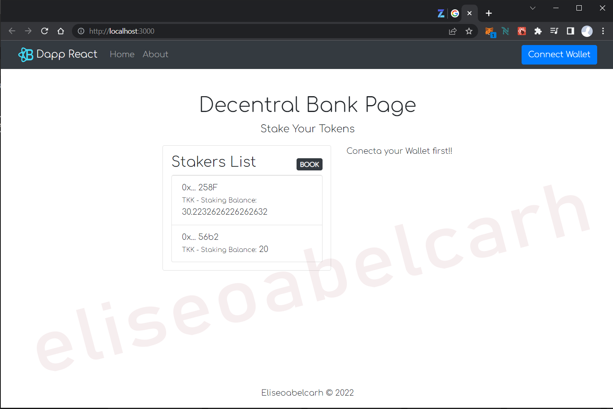

# My DAPP Boilerplate
## React Bootstrap and Metamask Starter


React Bootstrap Starter is a starter template for react and bootstrap created by [Eliseoabelcarh]


## Download and Installation

To begin using this template, choose one of the following options to get started:

Fork or clone the repository.

Install the dependencies:

```powershell-interactive
npm install
```

## Usage

Start editing and customizing according to your needs.

Run locally:

```powershell-interactive
npm start
```

## Dependencies:

- [React](https://reactjs.org/)
- [Create React App](https://create-react-app.dev/)
- [react-bootstrap](https://react-bootstrap.github.io/)
- [Web3](https://www.npmjs.com/package/web3)

## Bugs and Issues

Have a bug or an issue with this template? Open a new issue here on GitHub.

### Screenshots

